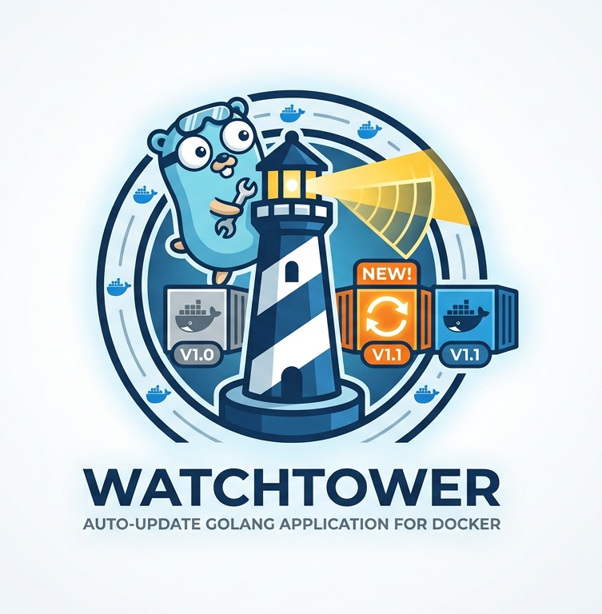

<div align="center">

  ### ⚠️ Upstream `containrrr/watchtower` is no longer maintained
  See https://github.com/containrrr/watchtower/discussions/2135 for details.

  ---
  
  
  
  # Watchtower
  
  A process for automating Docker container base image updates.
  <br/><br/>

  [](https://godoc.org/github.com/openserbia/watchtower)
  [](https://goreportcard.com/report/github.com/openserbia/watchtower)
  [](https://github.com/openserbia/watchtower/releases)
  [](https://hub.docker.com/r/containrrr/watchtower)

</div>

## Quick Start

With watchtower you can update the running version of your containerized app simply by pushing a new image to the Docker Hub or your own image registry. 

Watchtower will pull down your new image, gracefully shut down your existing container and restart it with the same options that were used when it was deployed initially. Run the watchtower container with the following command:

```
$ docker run --detach \
    --name watchtower \
    --volume /var/run/docker.sock:/var/run/docker.sock \
    containrrr/watchtower
```

Watchtower is intended to be used in homelabs, media centers, local dev environments, and similar. We do **not** recommend using Watchtower in a commercial or production environment. If that is you, you should be looking into using Kubernetes. If that feels like too big a step for you, please look into solutions like [MicroK8s](https://microk8s.io/) and [k3s](https://k3s.io/) that take away a lot of the toil of running a Kubernetes cluster. 

## Documentation
The full documentation is available at https://containrrr.dev/watchtower.

## Why this fork exists

This fork tracks a running deployment (Timeweb private registry, ~13 watched images, 60s poll) and collects fixes/flags for behaviors that bite in that setup. Issues I want to address here, in rough priority order:

1. **No retry-with-backoff on registry auth flakes.** When the registry's oauth endpoint returns a transient 403/404, Watchtower logs `no available image info. Proceeding to next.` and waits for the next poll with an identical request — no exponential backoff, no per-repository circuit breaker. For a flaky registry this can wedge a single image for minutes while manual `docker pull` succeeds instantly from the same host.
2. **Pull failures are logged at `info`, not `error`.** `WATCHTOWER_NOTIFICATIONS_LEVEL=error` silently swallows the exact pattern you want to see: repeated failed pulls for one container. Neither Watchtower nor a success-only event watcher will notify on a stuck-in-failure-loop image. Promoting this path to `warn`/`error` (or adding a dedicated "N consecutive pull failures" notification) is the fix.
3. **No self-metrics wired up by default.** Watchtower 1.7.x exposes Prometheus metrics via `WATCHTOWER_HTTP_API_METRICS=true` + token, but nothing ships ready-to-scrape. Alerts like `watchtower_containers_scanned_total` stuck at 0, or `scanned > 0 AND updated == 0 AND image_age > N days`, would have caught the above failure modes automatically.
4. **Label-based opt-in is fail-open.** Deploying a new service without `com.centurylinklabs.watchtower.enable=true` means Watchtower silently ignores it — no security updates, no warning. Indistinguishable from intentionally-excluded services (e.g. databases). A "tracked by neither watchtower nor an allowlist" audit would help.
5. **Races with manual compose deploys.** When `docker compose pull` lands between two polls, Watchtower's cached container ID from the previous poll can point at a ghost, producing `No such container` errors at `level=error`. Benign but noisy, and it pollutes the error channel enough to drown real failures. A mitigation (pause via HTTP API around manual deploys, or a short grace period on stale IDs) is worth exploring.
6. **`:latest` everywhere means a broken upstream push reaches prod in one poll interval.** Not a fork bug — a deliberate tradeoff — but documenting it here so it's explicit: there is no canary, no bake-in, no rollback checkpoint for third-party images (`traefik`, `grafana`, `postgres`, `umami`).

These are notes, not a roadmap — the upstream code is otherwise treated as-is, and PRs against `containrrr/watchtower` are still the right place for general-purpose fixes.
